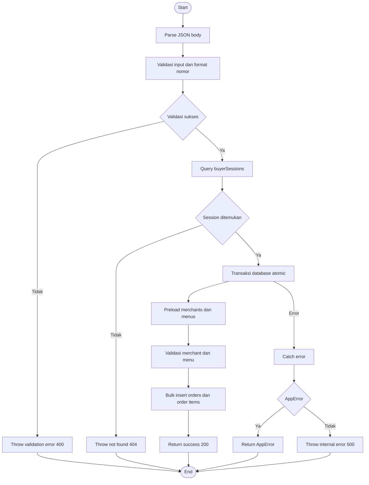
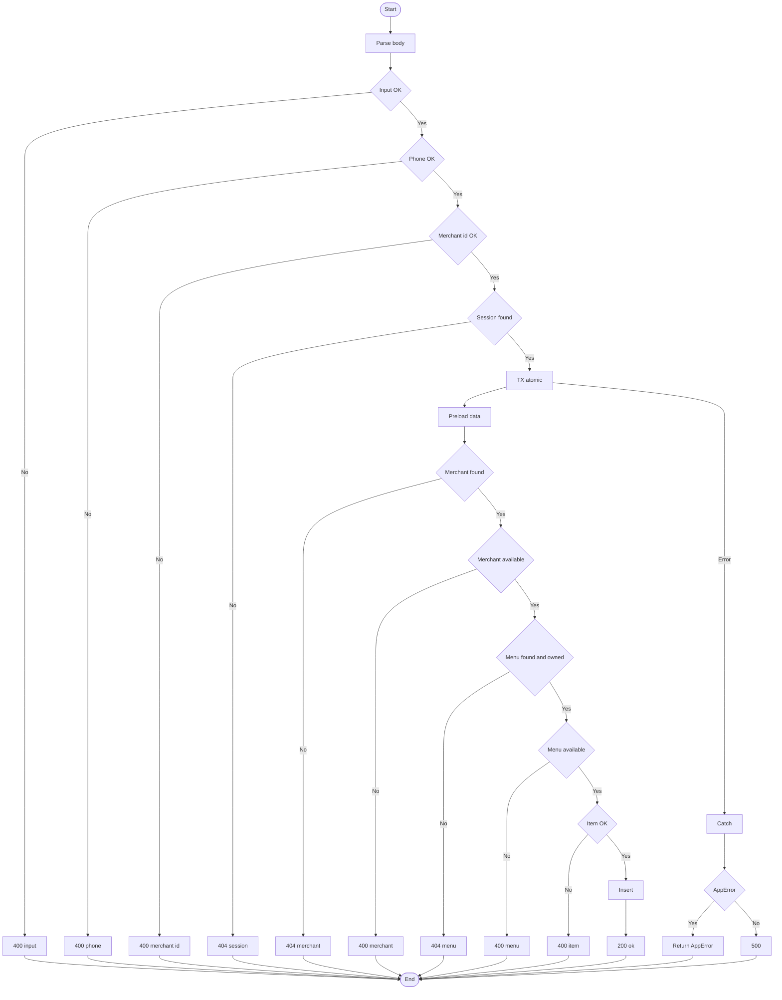

# DRPL (Dokumen Rencana Pengujian Perangkat Lunak)

## Sistem: Ngantri — Food Court Ordering System

**Versi**: 1.0  
**Tanggal**: 4 Januari 2026

---

## 1. Pendahuluan

### 1.1 Tujuan Pembuatan Dokumen

Dokumen Rencana Pengujian Perangkat Lunak (DRPL) ini dibuat dengan tujuan untuk:

- Mendefinisikan strategi, pendekatan, dan cakupan pengujian sistem Ngantri
- Menjadi acuan pelaksanaan pengujian (apa yang diuji, bagaimana pendekatan pengujiannya, dan batasannya).
- Menjadi dasar penentuan kriteria keberhasilan pengujian.

---

### 1.2 Ruang Lingkup Pengujian

Ruang lingkup pengujian pada dokumen ini dibatasi pada pengujian fungsional aplikasi web Ngantri. Fitur yang diuji meliputi:

- Mengisi informasi nomor meja, nama customer dan nomor WhatsApp.
- Memperbarui informasi nomor meja, nama customer dan nomor WhatsApp.
- Keranjang belanja (tambah/hapus/ubah jumlah item)
- Checkout (input nama dan nomor WhatsApp) dan pembuatan order.
- Pelacakan status order (mis. submitted/accepted/preparing/ready/completed).
- Fitur merchant: login, pengelolaan profil, pengelolaan menu, dan pengelolaan pesanan.
- Pengelolaan data merchant, menu, pesanan, dan sesi penggunaan.

---

### 1.3 Referensi

1. Dokumen Spesifikasi Kebutuhan Perangkat Lunak (SKPL)
   - Link: SKPL Ngantri
2. Source Code
   - Link: Github Ngantri

---

### 1.4 Overview Sistem & Fitur Utamanya

Ngantri adalah aplikasi web untuk pemesanan makanan di area food court. Buyer dapat memesan dari beberapa merchant dalam satu sesi (multi-merchant cart), melakukan checkout dengan identitas (nama dan nomor WhatsApp), lalu merchant memproses pesanan sampai selesai.

Fitur utama:

- Browse merchant & menu.
- Cart dan checkout (nama + WhatsApp).
- Pelacakan status order end-to-end.
- Dashboard merchant untuk manajemen menu dan order.
- Layanan pengelolaan merchant, menu, pesanan, dan sesi penggunaan.

---

### 1.5 Overview Pengujian

Pengujian dilakukan bertingkat untuk menutup risiko pada level logika bisnis dan alur penggunaan aplikasi.

**Pendekatan pengujian yang digunakan:**

- Pengujian integrasi dengan Jest.
- Pengujian End-to-End (E2E) dengan Playwright.

---

### 1.5.1 Perangkat Keras Pengujian

Perangkat keras yang digunakan untuk menguji software ini terdiri dari:

- Perangkat : Laptop
- Processor : Intel Core i5
- RAM : 16 GB
- Storage: Minimal 10 GB ruang kosong untuk dependency Node.js, cache, dan image Docker

---

### 1.5.2 Sumber Daya Manusia

Sumber daya manusia yang terlibat dalam pengujian perangkat lunak:

| No. | Nama Anggota     | Peran |
| --: | ---------------- | ----- |
|  1. | M. Iqbal Maulana |       |
|  2. | Arif Widianto    |       |
|  3. | Ahmad Farhan     |       |
|  4. | Gardha Dananjaya |       |

---

### 1.5.3 Perangkat Lunak Pengujian

Perangkat lunak yang digunakan untuk pengujian:

- Runtime: Node.js 18+
- Package manager: npm
- Database: PostgreSQL
- Container: Docker & Docker Compose
- Browser: Chrome/Chromium

Framework pengujian:

- Jest (unit dan integrasi)
- Playwright (E2E)

---

### 1.5.4 Material Pengujian

Material pengujian menjelaskan modul-modul yang akan diuji pada sistem Ngantri. Modul yang diuji meliputi:

1. Customer
   - Akses halaman utama (Mengisi informasi nomor meja, nama customer dan nomor WhatsApp)
   - browsing merchant dan menu.
   - Keranjang belanja (cart) dan total belanja.
   - Checkout dan konfirmasi order.
   - Halaman riwayat/daftar order dan status order.
2. Merchant
   - Autentikasi merchant (login).
   - Dashboard merchant.
   - Manajemen menu (tambah/ubah/hapus menu, status ketersediaan).
   - Manajemen pesanan (melihat pesanan masuk, mengubah status pesanan).
3. Admin
   - Melihat dan mengatur order status.
   - Manajemen merchant (tambah/ubah/hapus).

---

### 1.5.5 Strategi dan Metode Pengujian

Menjelaskan strategi dan metode pengujian yang akan digunakan.

---

### 1.5.6 Jadwal Pengujian

Tabel 1.2 Jadwal Pengujian

| Use Case                                      | PIC    | Jadwal pengujian |
| --------------------------------------------- | ------ | ---------------- |
| Akses halaman utama (isi info meja/nama/WA)   | Arif   | 4 Januari 2026   |
| Update info meja/nama/WA                      | Arif   | 4 Januari 2026   |
| browsing merchant dan menu                    | Gardha | 4 Januari 2026   |
| Keranjang belanja (tambah/hapus/ubah jumlah)  | Farhan | 4 Januari 2026   |
| Checkout dan konfirmasi order                 | Arif   | 4 Januari 2026   |
| Halaman riwayat/daftar order dan status order | Gardha | 4 Januari 2026   |
| Merchant: Login                               | Iqbal  | 4 Januari 2026   |
| Merchant: Dashboard Overview                  | Iqbal  | 4 Januari 2026   |
| Merchant: Kelola Profil                       | Farhan | 4 Januari 2026   |
| Merchant: Manajemen menu                      | Arif   | 4 Januari 2026   |
| Merchant: Manajemen kategori                  | Admin  | 4 Januari 2026   |
| Merchant: Manajemen pesanan                   | Iqbal  | 4 Januari 2026   |
| Admin: Login                                  | Gardha | 4 Januari 2026   |
| Admin: Dashboard Overview                     | Gardha | 4 Januari 2026   |
| Admin: Kelola Profil                          | Gardha | 4 Januari 2026   |
| Admin: Manajemen merchant (tambah/ubah/hapus) | Farhan | 4 Januari 2026   |
| Admin: Manajemen kategori                     | Farhan | 4 Januari 2026   |
| Admin: Melihat & mengatur order status        | Iqbal  | 4 Januari 2026   |
| Admin: Manajemen menu                         | Arif   | 4 Januari 2026   |

---

## 2 Pelaksanaan Pengujian

(Uraiakan pengujian sesuai dengan butir uji yang sudah didefinisikan dalam rencana pengujian)

### 2.1 Pengujian UNIT

#### 2.1.1 Pengujian White Box Method

**a. Pilih method paling rumit dari class paling rumit**

Untuk pengujian white-box pada sistem Ngantri, proses **checkout** direpresentasikan oleh fungsi pemrosesan **checkout pesanan gabungan** (pembuatan beberapa pesanan dalam satu proses), yaitu:

- **Unit yang diuji**: Fungsi pemrosesan checkout pesanan gabungan
- **Nama fungsi**: `createBatchOrders`
- **Lokasi kode**: `src/services/order-service.ts`

Fungsi ini dipilih karena berada pada jalur kritikal checkout (pembuatan pesanan untuk multi-merchant dalam satu transaksi) dan memuat validasi utama yang menentukan apakah checkout dapat diproses, khususnya pemeriksaan **format nomor WhatsApp**, **ketersediaan merchant**, serta **ketersediaan dan kepemilikan menu per-merchant**. Selain itu, fungsi ini melakukan penyimpanan data dalam satu transaksi agar seluruh pesanan bersifat atomik (seluruhnya berhasil atau seluruhnya gagal).

Catatan penting: pada versi terbaru, sebagian besar percabangan logika checkout telah dipindahkan ke helper method. Karena itu, unit white-box yang diuji dipahami sebagai **alur checkout** yang dimulai dari `createBatchOrders` dan melewati helper berikut (critical path):

- `validatePhoneNumber` (validasi format nomor)
- `validateBatchMerchants` (validasi merchant + ketersediaan + items tidak kosong)
- `validateAndPrepareBatchItems` (validasi menu + qty/price + akumulasi total)
- `preloadBatchMerchants` / `preloadBatchMenus` (bulk preload data)
- `buildBatchOrders` (membentuk payload insert)

Fungsi ini memproses checkout sebagai berikut:

1. Memeriksa kelengkapan data checkout (sessionId, customerName, customerPhone, ordersByMerchant). Jika tidak lengkap, proses ditolak.
2. Memvalidasi format nomor WhatsApp customer (Indonesia). Jika tidak valid, proses ditolak.
3. Memastikan pesanan per-merchant tidak kosong serta setiap merchantId valid (bukan kosong/"undefined").
4. Memastikan sesi penggunaan (buyer session) ada. Jika sesi tidak ditemukan, proses ditolak.
5. Menjalankan penyimpanan data dalam satu transaksi agar seluruh pembuatan order bersifat atomik.
6. Memuat data merchant (yang belum dihapus) dan menu (yang belum dihapus) sekali di awal transaksi (bulk preload), lalu melakukan pemeriksaan:
   - Merchant harus ada.
   - Merchant harus tersedia untuk menerima pesanan (`isAvailable`).
   - Setiap item harus mengacu ke menu yang ada dan milik merchant tersebut.
   - Menu harus tersedia untuk dipesan (`isAvailable`).
7. Memvalidasi setiap item (qty integer > 0 dan <= 100, unitPrice > 0), serta mengakumulasi subtotal menjadi totalAmount per merchant.
8. Jika pemeriksaan lolos, sistem membuat ID order per-merchant, menghitung total per merchant, lalu melakukan **bulk insert** untuk seluruh order dan order item.
9. Jika terjadi kegagalan saat transaksi (validasi atau error DB), transaksi dibatalkan dan sistem mengembalikan error sesuai kategorinya.

---

**b. Flowchart/Flowgraph**

Flowgraph checkout mencakup jalur utama: **validasi input (bad request)**, **validasi sesi (not found)**, **validasi merchant/menu (validation/not found)**, dan **kegagalan proses penyimpanan data (internal error)**.

**Versi 1: Main (ringkas, report friendly)**

**Versi 2: Extended (lebih detail, tetap vertikal)**

Keterangan (Versi Extended):

- 400 input: field wajib kosong atau ordersByMerchant kosong
- 400 phone: format nomor WhatsApp tidak valid
- 400 merchant id: merchantId kosong atau "undefined"
- 404 session: sessionId tidak ditemukan
- 404 merchant: merchant tidak ditemukan
- 400 merchant: merchant tidak tersedia
- 404 menu: menu tidak ditemukan atau bukan milik merchant
- 400 menu: menu tidak tersedia
- 400 item: quantity atau unit price tidak valid
- 500: error internal saat transaksi

---

**c. Hitung cyclomatic complexity**

1. Fungsi `createBatchOrders` (checkout pesanan gabungan)

- Catatan metode perhitungan

  Pada versi terbaru, logika checkout dipisah ke beberapa helper. Karena itu, ditampilkan dua metrik:

  1.  **CC (fungsi utama)**: hanya menghitung decision point di dalam `createBatchOrders`.
  2.  **CC (expanded/checkout path)**: menghitung decision point gabungan pada `createBatchOrders` + helper utama yang berada pada jalur checkout (validasi input/merchant/menu) sehingga lebih representatif terhadap kompleksitas alur checkout.

  Aturan decision point yang digunakan:

  - `if`, `for`, dan operator ternary `?:` dihitung sebagai decision point.
  - Kondisi gabungan dengan `||` / `&&` dihitung menambah decision point (mis. `if (a || b)` dihitung 2 decision point: `if` + operator `||`).

- Struktur logika (fungsi utama `createBatchOrders`):

  - 7 buah percabangan `if` (validasi input: `sessionId`, `customerName`, `customerPhone`, `ordersByMerchant`, validasi `merchantId`, validasi session, dan klasifikasi error pada `catch`).
  - 1 buah perulangan `for` (validasi `merchantId` agar tidak kosong/"undefined").
  - Validasi merchant dan menu tetap ada, namun sudah diekstrak ke helper (`validateBatchMerchants`, `validateAndPrepareBatchItems`) sehingga fungsi utama lebih ringkas.
  - Penanganan error terpusat melalui `try/catch` dan hanya dibedakan menjadi: `AppError` vs error umum.

- Perhitungan cyclomatic complexity (fungsi utama):

  - Jumlah decision point = 8, berasal dari:
    1. `sessionId` ada atau tidak
    2. `customerName` ada atau tidak
    3. `customerPhone` ada atau tidak
    4. `ordersByMerchant` kosong atau tidak
    5. Loop validasi `merchantId` (iterasi ada atau tidak)
    6. `merchantId` valid atau tidak
    7. Session ditemukan atau tidak
    8. Error yang tertangkap merupakan `AppError` atau bukan
  - Rumus: $CC = \text{decision points} + 1$
  - $CC = 8 + 1 = 9$

- Perhitungan cyclomatic complexity (expanded/checkout path)

  Helper yang dihitung (jalur checkout):

  - `createBatchOrders`
  - `validatePhoneNumber`
  - `preloadBatchMenus`
  - `validateBatchMerchants`
  - `validateAndPrepareBatchItems`
  - `generateBatchOrderIds`
  - `buildBatchOrders`

  Tabel ringkas (per-method):

  | Method                         | Decision Points |  CC |
  | ------------------------------ | --------------: | --: |
  | `createBatchOrders`            |               8 |   9 |
  | `validatePhoneNumber`          |               3 |   4 |
  | `preloadBatchMenus`            |               1 |   2 |
  | `validateBatchMerchants`       |               5 |   6 |
  | `validateAndPrepareBatchItems` |               9 |  10 |
  | `generateBatchOrderIds`        |               1 |   2 |
  | `buildBatchOrders`             |               1 |   2 |

  Total decision points (expanded) = $8 + 3 + 1 + 5 + 9 + 1 + 1 = 28$

  Dengan pendekatan gabungan:

  - $CC_{expanded} = 28 + 1 = 29$

- Interpretasi:
  - **CC (fungsi utama) = 9** termasuk kategori **Low Risk (1–10)**.
  - **CC (expanded) = 29** termasuk kategori **High Risk (21–50)** untuk keseluruhan alur checkout, karena banyak jalur validasi (merchant/menu/quantity/price) dan transaksi.
  - Kesimpulan praktik: meskipun fungsi utama tampak ringkas, pengujian white-box tetap perlu menutup jalur gagal/sukses pada helper yang menentukan keberhasilan checkout.

Ringkasan Nilai Cyclomatic Complexity

- Fungsi `createBatchOrders()` : $CC = 9$ → Low Risk.
- Total gabungan (expanded checkout path): $CC_{expanded} = 29$ → High Risk.

Kategori umum Cyclomatic Complexity:

- 1–10: Low Risk — Kode sederhana, mudah diuji dan dipelihara.
- 11–20: Moderate Risk — Kode mulai kompleks, perlu perhatian ekstra.
- 21–50: High Risk — Kode kompleks, cukup sulit diuji.
- > 50: Very High Risk — Kode sangat kompleks, sangat disarankan refactoring.

Kesimpulan

Fungsi `createBatchOrders()` memiliki $CC = 9$ (Low Risk) pada fungsi utamanya, karena sebagian percabangan sudah dipindahkan ke helper. Namun, bila dihitung sebagai satu alur checkout (expanded) dengan helper validasi utama, kompleksitas menjadi $CC_{expanded} = 29$ (High Risk). Oleh karena itu, pengujian white-box tetap menargetkan basis path untuk menutup skenario gagal validasi input, session tidak ditemukan, merchant/menu tidak valid/tidak tersedia, validasi item (qty/price), dan jalur sukses transaksi.

---

**d. Daftar Path yang perlu diuji**

Tabel 2.1 Daftar Path

| Path   | Deskripsi Alur                                                                                                                                                                                                                |
| ------ | ----------------------------------------------------------------------------------------------------------------------------------------------------------------------------------------------------------------------------- |
| Path 1 | Payload checkout tidak lengkap/invalid (mis. `sessionId`/`customerName`/`customerPhone` kosong, atau `ordersByMerchant` kosong). Sistem menolak request dengan error validasi (400) dan tidak membuat order.                  |
| Path 2 | Payload valid, namun `merchantId` tidak valid (kosong atau string "undefined"). Sistem menolak request dengan error validasi (400) dan tidak membuat order.                                                                   |
| Path 3 | Payload valid, namun `sessionId` tidak ditemukan pada `buyerSessions`. Sistem menolak request (404) dan tidak membuat order.                                                                                                  |
| Path 4 | Payload valid, session ada, namun merchant/menu tidak valid (merchant tidak ada/tidak available, menu tidak ada/tidak available/tidak milik merchant). Sistem menolak request (400/404 sesuai kasus) dan tidak membuat order. |
| Path 5 | Payload valid, session ada, semua merchant & menu valid, transaksi sukses. Sistem membuat order per-merchant secara atomik dan mengembalikan respons sukses (200).                                                            |

---

**e. Siapkan data uji untuk setiap path**

Tabel 2.2 Data Uji

| Path   | Kondisi Pengujian                                                                                                                                     | Hasil yang Diharapkan                                                                                                                                                     |
| ------ | ----------------------------------------------------------------------------------------------------------------------------------------------------- | ------------------------------------------------------------------------------------------------------------------------------------------------------------------------- |
| Path 1 | Payload checkout tanpa salah satu field wajib (mis. `customerPhone=""`) atau `ordersByMerchant={}`.                                                   | API mengembalikan error validasi (400) dengan pesan sesuai field yang hilang; tidak ada order yang dibuat.                                                                |
| Path 2 | Payload valid, namun ada key merchant seperti `"undefined"` atau `""` pada `ordersByMerchant`.                                                        | API mengembalikan error validasi (400) "Invalid merchant ID provided"; tidak ada order yang dibuat.                                                                       |
| Path 3 | Payload valid, namun `sessionId` tidak ada pada DB.                                                                                                   | API mengembalikan error not found (404) "Session not found"; tidak ada order yang dibuat.                                                                                 |
| Path 4 | Payload valid, session ada, namun (a) merchant `isAvailable=false` / tidak ada, atau (b) menu tidak ada / `isAvailable=false` / tidak milik merchant. | API mengembalikan error (400/404 sesuai kasus) seperti "Merchant <name> is not available" atau "Menu not found: <id>"; transaksi dibatalkan; tidak ada order yang dibuat. |
| Path 5 | Payload valid, session ada, semua merchant & menu valid.                                                                                              | API mengembalikan sukses (200) dan membuat order per-merchant secara atomik (all succeed or all fail).                                                                    |

---

**f. Tangkapan layar hasil**

Tangkapan layar yang dilampirkan berasal dari hasil eksekusi pengujian unit (Jest) untuk Path 1–5, dengan fokus pada validasi backend API handler (`createBatchOrders`).

---

**g. Tabel kasus dan hasil uji (format laporan)**

Tabel berikut disusun berdasarkan basis path P1–P5 pada checkout. Bagian **Pengamatan** dan referensi **Lampiran** dapat disesuaikan dengan hasil eksekusi pengujian dan dokumentasi yang dilampirkan.

| Kelas                            | Metode                    | Data Masukan                                                                               | Yang Diharapkan                                                                                | Pengamatan\*           | Kesimpulan |
| -------------------------------- | ------------------------- | ------------------------------------------------------------------------------------------ | ---------------------------------------------------------------------------------------------- | ---------------------- | ---------- |
| Proses checkout pesanan gabungan | Checkout pesanan gabungan | **Path 1 — input/checkout tidak valid**: payload checkout tidak lengkap atau cart kosong.  | Sistem menolak request (400) dan tidak membuat order.                                          | (Isi sesuai hasil uji) | Diterima   |
| Proses checkout pesanan gabungan | Checkout pesanan gabungan | **Path 2 — merchantId tidak valid**: payload valid, namun key merchant kosong/"undefined". | Sistem menolak request (400) dan tidak membuat order.                                          | (Isi sesuai hasil uji) | Diterima   |
| Proses checkout pesanan gabungan | Checkout pesanan gabungan | **Path 3 — session tidak ditemukan**: payload valid, namun `sessionId` tidak ada.          | Sistem menolak request (404) dan tidak membuat order.                                          | (Isi sesuai hasil uji) | Diterima   |
| Proses checkout pesanan gabungan | Checkout pesanan gabungan | **Path 4 — merchant/menu tidak valid**: merchant/menu tidak ada atau tidak tersedia.       | Sistem menolak request (400/404) dan tidak membuat order (transaksi dibatalkan).               | (Isi sesuai hasil uji) | Diterima   |
| Proses checkout pesanan gabungan | Checkout pesanan gabungan | **Path 5 — sukses checkout**: payload valid, `sessionId` valid, item valid.                | Sistem membuat order per-merchant dalam satu transaksi dan mengembalikan respons sukses (200). | (Isi sesuai hasil uji) | Diterima   |

\*Pengamatan diisi berdasarkan hasil pelaksanaan pengujian dan dapat dirujuk pada lampiran (tangkapan layar/log) yang disediakan.

Langkah menjalankan (contoh):

1. Jalankan pengujian unit.
2. Pastikan hasil pengujian berjalan tanpa kesalahan.
3. Ambil screenshot hasil output pada terminal dan tempel pada laporan.

---

#### 2.1.2 Pengujian Class dengan Jest

Bagian ini merangkum **seluruh pengujian unit (Jest)** yang ada pada folder `tests/unit/**` pada sistem Ngantri. Pengujian mencakup:

1. **Service layer** (logika bisnis + validasi) pada folder `tests/unit/services/*`.
2. **Repository layer** (akses data/DB gateway) pada folder `tests/unit/repositories/*`.

Format tabel mengikuti struktur pada gambar: kolom **CLASS** dan **Method**, serta bagian **Kasus dan Hasil Uji** yang memuat **Data Masukan** dan **Yang Diharapkan**, lalu **Pengamatan** dan **Kesimpulan**.

Catatan:

- Kolom **Pengamatan** diisi berdasarkan hasil pelaksanaan pengujian dan dapat dilampirkan sebagai bukti (tangkapan layar/log).
- Kolom **Kesimpulan** diisi “Diterima” apabila hasil aktual sesuai yang diharapkan.

---

##### A. Unit Test — Service Layer

**Kelas yang diuji:** `SessionService`, `MerchantService`, `MenuService`, `OrderService`  
**Lokasi:** `src/services/*`  
**Berkas unit test:** `tests/unit/services/*`

**Tabel 2.1.2-A Pengujian Class Unit (Service Layer)**

<table>
	<thead>
		<tr>
			<th rowspan="2">CLASS</th>
			<th rowspan="2">Method</th>
			<th colspan="2">Kasus dan Hasil Uji (Data normal)</th>
			<th rowspan="2">Pengamatan</th>
			<th rowspan="2">Kesimpulan</th>
		</tr>
		<tr>
			<th>Data Masukan</th>
			<th>Yang Diharapkan</th>
		</tr>
	</thead>
	<tbody>
		<!-- SessionService — tests/unit/services/session-service.unit.test.ts -->
		<tr>
			<td>SessionService</td>
			<td>createSession</td>
			<td>VALID: <code>{ tableNumber: 5 }</code></td>
			<td>Session berhasil dibuat, repository <code>createSession()</code> dipanggil dengan <code>tableNumber=5</code>.</td>
			<td></td>
			<td>Diterima</td>
		</tr>
		<tr>
			<td>SessionService</td>
			<td>createSession</td>
			<td>VALID: tanpa parameter</td>
			<td>Session berhasil dibuat dengan <code>tableNumber=null</code>.</td>
			<td></td>
			<td>Diterima</td>
		</tr>
		<tr>
			<td>SessionService</td>
			<td>createSession</td>
			<td>FAIL: <code>{ tableNumber: -1 }</code></td>
			<td>Sistem menolak input dan melempar <code>VALIDATION_ERROR (400)</code>.</td>
			<td></td>
			<td>Diterima</td>
		</tr>
		<tr>
			<td>SessionService</td>
			<td>createSession</td>
			<td>FAIL: repository melempar error (mis. DB down)</td>
			<td>Sistem membungkus error menjadi <code>INTERNAL_SERVER_ERROR (500)</code>.</td>
			<td></td>
			<td>Diterima</td>
		</tr>
		<tr>
			<td>SessionService</td>
			<td>findSessionById</td>
			<td>VALID: <code>id="s3"</code> (session ada)</td>
			<td>Mengembalikan data session.</td>
			<td></td>
			<td>Diterima</td>
		</tr>
		<tr>
			<td>SessionService</td>
			<td>findSessionById</td>
			<td>FAIL: <code>id="missing"</code> (session tidak ada)</td>
			<td>Melempar <code>NOT_FOUND (404)</code>.</td>
			<td></td>
			<td>Diterima</td>
		</tr>
		<tr>
			<td>SessionService</td>
			<td>findSessionById</td>
			<td>FAIL: repository melempar error</td>
			<td>Sistem membungkus error menjadi <code>INTERNAL_SERVER_ERROR (500)</code>.</td>
			<td></td>
			<td>Diterima</td>
		</tr>
		<tr>
			<td>SessionService</td>
			<td>findOrCreateSession</td>
			<td>VALID: <code>id="keep"</code> (session ada)</td>
			<td>Mengembalikan session yang ada, tanpa memanggil <code>createSession()</code>.</td>
			<td></td>
			<td>Diterima</td>
		</tr>
		<tr>
			<td>SessionService</td>
			<td>findOrCreateSession</td>
			<td>VALID: <code>id="new"</code> (session tidak ada)</td>
			<td>Membuat session dengan <code>id</code> tersebut dan mengembalikannya.</td>
			<td></td>
			<td>Diterima</td>
		</tr>
		<tr>
			<td>SessionService</td>
			<td>findOrCreateSession</td>
			<td>FAIL: repository melempar <code>AppError</code> (contoh: NOT_FOUND)</td>
			<td><code>AppError</code> dilempar kembali apa adanya (tidak dibungkus).</td>
			<td></td>
			<td>Diterima</td>
		</tr>
		<tr>
			<td>SessionService</td>
			<td>updateTableNumber</td>
			<td>VALID: <code>id="s5", tableNumber=3</code></td>
			<td>Session ter-update, repository <code>updateSession()</code> dipanggil dengan <code>tableNumber=3</code>.</td>
			<td></td>
			<td>Diterima</td>
		</tr>
		<tr>
			<td>SessionService</td>
			<td>updateTableNumber</td>
			<td>FAIL: <code>tableNumber=0</code></td>
			<td>Melempar <code>VALIDATION_ERROR (400)</code>.</td>
			<td></td>
			<td>Diterima</td>
		</tr>
		<tr>
			<td>SessionService</td>
			<td>updateTableNumber</td>
			<td>FAIL: <code>tableNumber=1000</code></td>
			<td>Melempar <code>VALIDATION_ERROR (400)</code>.</td>
			<td></td>
			<td>Diterima</td>
		</tr>
		<tr>
			<td>SessionService</td>
			<td>updateTableNumber</td>
			<td>FAIL: session tidak ditemukan (repo mengembalikan <code>null</code>)</td>
			<td>Melempar <code>NOT_FOUND (404)</code>.</td>
			<td></td>
			<td>Diterima</td>
		</tr>
		<tr>
			<td>SessionService</td>
			<td>deleteSession</td>
			<td>VALID: <code>id="s6"</code> (session ada), <code>softDeleteSession()</code> mengembalikan <code>true</code></td>
			<td>Soft delete sukses (tidak melempar error) dan <code>softDeleteSession()</code> dipanggil.</td>
			<td></td>
			<td>Diterima</td>
		</tr>
		<tr>
			<td>SessionService</td>
			<td>deleteSession</td>
			<td>FAIL: <code>softDeleteSession()</code> mengembalikan <code>false</code></td>
			<td>Melempar <code>INTERNAL_SERVER_ERROR (500)</code>.</td>
			<td></td>
			<td>Diterima</td>
		</tr>
		<tr>
			<td>SessionService</td>
			<td>validateSessionData</td>
			<td>VALID: <code>{}</code> (tanpa tableNumber)</td>
			<td>Tidak ada error.</td>
			<td></td>
			<td>Diterima</td>
		</tr>
		<tr>
			<td>SessionService</td>
			<td>validateSessionData</td>
			<td>FAIL: <code>{ tableNumber: -5 }</code></td>
			<td>Melempar <code>VALIDATION_ERROR (400)</code>.</td>
			<td></td>
			<td>Diterima</td>
		</tr>
		<tr>
			<td>SessionService</td>
			<td>getActiveSessionsCount</td>
			<td>VALID: tanpa input</td>
			<td>Mengembalikan placeholder <code>0</code>.</td>
			<td></td>
			<td>Diterima</td>
		</tr>
		<tr>
			<td>SessionService</td>
			<td>getSessionStats</td>
			<td>VALID: tanpa input</td>
			<td>Mengembalikan placeholder stats (semua bernilai 0).</td>
			<td></td>
			<td>Diterima</td>
		</tr>

    	<!-- MerchantService — tests/unit/services/merchant-service.unit.test.ts -->
    	<tr>
    		<td>MerchantService</td>
    		<td>register</td>
    		<td>VALID: <code>{ phoneNumber, password, name }</code> (unik, password kuat)</td>
    		<td>Password di-hash, nomor merchant baru diambil, dan merchant dibuat dengan <code>isAvailable=true</code>.</td>
        		<td></td>
    		<td>Diterima</td>
    	</tr>
    	<tr>
    		<td>MerchantService</td>
    		<td>register</td>
    		<td>FAIL: phoneNumber sudah terdaftar</td>
    		<td>Melempar <code>CONFLICT</code>.</td>
        		<td></td>
    		<td>Diterima</td>
    	</tr>
    	<tr>
    		<td>MerchantService</td>
    		<td>register</td>
    		<td>FAIL: password lemah (mis. "short")</td>
    		<td>Melempar <code>VALIDATION_ERROR</code>.</td>
        		<td></td>
    		<td>Diterima</td>
    	</tr>
    	<tr>
    		<td>MerchantService</td>
    		<td>login</td>
    		<td>VALID: kredensial benar</td>
    		<td>Login berhasil dan mengembalikan data merchant.</td>
        		<td></td>
    		<td>Diterima</td>
    	</tr>
    	<tr>
    		<td>MerchantService</td>
    		<td>login</td>
    		<td>FAIL: merchant tidak ditemukan</td>
    		<td>Melempar <code>INVALID_CREDENTIALS</code>.</td>
        		<td></td>
    		<td>Diterima</td>
    	</tr>
    	<tr>
    		<td>MerchantService</td>
    		<td>login</td>
    		<td>FAIL: password salah</td>
    		<td>Melempar <code>INVALID_CREDENTIALS</code>.</td>
        		<td></td>
    		<td>Diterima</td>
    	</tr>
    	<tr>
    		<td>MerchantService</td>
    		<td>login</td>
    		<td>FAIL: merchant tidak aktif (<code>isAvailable=false</code>)</td>
    		<td>Melempar <code>MERCHANT_INACTIVE</code>.</td>
        		<td></td>
    		<td>Diterima</td>
    	</tr>
    	<tr>
    		<td>MerchantService</td>
    		<td>validatePassword</td>
    		<td>VALID: bcrypt compare mengembalikan <code>true</code></td>
    		<td>Mengembalikan <code>true</code>.</td>
        		<td></td>
    		<td>Diterima</td>
    	</tr>
    	<tr>
    		<td>MerchantService</td>
    		<td>validatePassword</td>
    		<td>FAIL: bcrypt compare melempar error</td>
    		<td>Melempar <code>INTERNAL_SERVER_ERROR</code>.</td>
        		<td></td>
    		<td>Diterima</td>
    	</tr>
    	<tr>
    		<td>MerchantService</td>
    		<td>findById</td>
    		<td>VALID: <code>id</code> ada</td>
    		<td>Mengembalikan merchant.</td>
        		<td></td>
    		<td>Diterima</td>
    	</tr>
    	<tr>
    		<td>MerchantService</td>
    		<td>findById</td>
    		<td>FAIL: <code>id</code> tidak ada</td>
    		<td>Melempar <code>MERCHANT_NOT_FOUND</code>.</td>
        		<td></td>
    		<td>Diterima</td>
    	</tr>
    	<tr>
    		<td>MerchantService</td>
    		<td>update</td>
    		<td>VALID: update profil (contoh: <code>{ name: "Updated" }</code>)</td>
    		<td>Memanggil repository update dan mengembalikan merchant yang telah ter-update.</td>
        		<td></td>
    		<td>Diterima</td>
    	</tr>
    	<tr>
    		<td>MerchantService</td>
    		<td>softDelete</td>
    		<td>VALID: repo softDelete mengembalikan <code>true</code></td>
    		<td>Soft delete sukses (tidak melempar error).</td>
        		<td></td>
    		<td>Diterima</td>
    	</tr>
    	<tr>
    		<td>MerchantService</td>
    		<td>activate</td>
    		<td>VALID: set <code>isAvailable=true</code></td>
    		<td>Merchant aktif, nilai <code>isAvailable</code> menjadi <code>true</code>.</td>
        		<td></td>
    		<td>Diterima</td>
    	</tr>
    	<tr>
    		<td>MerchantService</td>
    		<td>deactivate</td>
    		<td>VALID: set <code>isAvailable=false</code></td>
    		<td>Merchant nonaktif, nilai <code>isAvailable</code> menjadi <code>false</code>.</td>
        		<td></td>
    		<td>Diterima</td>
    	</tr>
    	<tr>
    		<td>MerchantService</td>
    		<td>updateProfileImage</td>
    		<td>VALID: <code>imageUrl</code> baru</td>
    		<td>Merchant ter-update dengan <code>imageUrl</code> baru.</td>
        		<td></td>
    		<td>Diterima</td>
    	</tr>
    	<tr>
    		<td>MerchantService</td>
    		<td>isPhoneNumberUnique</td>
    		<td>VALID: phoneNumber belum ada</td>
    		<td>Mengembalikan <code>true</code>.</td>
        		<td></td>
    		<td>Diterima</td>
    	</tr>
    	<tr>
    		<td>MerchantService</td>
    		<td>isPhoneNumberUnique</td>
    		<td>VALID: phoneNumber ada, tapi <code>excludeId</code> sama</td>
    		<td>Mengembalikan <code>true</code>.</td>
        		<td></td>
    		<td>Diterima</td>
    	</tr>
    	<tr>
    		<td>MerchantService</td>
    		<td>isPhoneNumberUnique</td>
    		<td>VALID: phoneNumber ada dan milik merchant lain</td>
    		<td>Mengembalikan <code>false</code>.</td>
        		<td></td>
    		<td>Diterima</td>
    	</tr>

    	<!-- MenuService — tests/unit/services/menu-service.unit.test.ts -->
    	<tr>
    		<td>MenuService</td>
    		<td>createMenuItem</td>
    		<td>VALID: <code>{ merchantId, categoryId, name, price }</code></td>
    		<td>Menu item dibuat, <code>isAvailable=true</code>, dan repository <code>create()</code> dipanggil.</td>
        		<td></td>
    		<td>Diterima</td>
    	</tr>
    	<tr>
    		<td>MenuService</td>
    		<td>createMenuItem</td>
    		<td>FAIL: name kosong</td>
    		<td>Melempar <code>VALIDATION_ERROR</code>.</td>
        		<td></td>
    		<td>Diterima</td>
    	</tr>
    	<tr>
    		<td>MenuService</td>
    		<td>createMenuItem</td>
    		<td>FAIL: repository melempar error</td>
    		<td>Melempar <code>INTERNAL_SERVER_ERROR</code>.</td>
        		<td></td>
    		<td>Diterima</td>
    	</tr>
    	<tr>
    		<td>MenuService</td>
    		<td>findMenuItemById</td>
    		<td>VALID: menu ada</td>
    		<td>Mengembalikan data menu.</td>
        		<td></td>
    		<td>Diterima</td>
    	</tr>
    	<tr>
    		<td>MenuService</td>
    		<td>findMenuItemById</td>
    		<td>FAIL: menu tidak ditemukan</td>
    		<td>Melempar <code>MENU_NOT_FOUND</code>.</td>
        		<td></td>
    		<td>Diterima</td>
    	</tr>
    	<tr>
    		<td>MenuService</td>
    		<td>findMenuItemsByMerchant</td>
    		<td>VALID: <code>merchantId</code> + pagination</td>
    		<td>Mengembalikan hasil paginasi dan memanggil repository <code>findByMerchant()</code>.</td>
    		<td></td>
    		<td>Diterima</td>
    	</tr>
    	<tr>
    		<td>MenuService</td>
    		<td>updateMenuItem</td>
    		<td>VALID: update menu (contoh: <code>{ price: 25000 }</code>)</td>
    		<td>Menu ter-update dan repository <code>update()</code> dipanggil.</td>
    		<td></td>
    		<td>Diterima</td>
    	</tr>
    	<tr>
    		<td>MenuService</td>
    		<td>updateMenuItem</td>
    		<td>FAIL: harga invalid (contoh: <code>-1</code>)</td>
    		<td>Melempar <code>VALIDATION_ERROR</code>.</td>
    		<td></td>
    		<td>Diterima</td>
    	</tr>
    	<tr>
    		<td>MenuService</td>
    		<td>deleteMenuItem</td>
    		<td>VALID: repo softDelete mengembalikan <code>true</code></td>
    		<td>Soft delete sukses (tidak melempar error).</td>
    		<td></td>
    		<td>Diterima</td>
    	</tr>
    	<tr>
    		<td>MenuService</td>
    		<td>deleteMenuItem</td>
    		<td>FAIL: repo softDelete mengembalikan <code>false</code></td>
    		<td>Melempar <code>INTERNAL_SERVER_ERROR</code>.</td>
    		<td></td>
    		<td>Diterima</td>
    	</tr>
    	<tr>
    		<td>MenuService</td>
    		<td>createCategory</td>
    		<td>VALID: <code>{ merchantId, name }</code></td>
    		<td>Kategori dibuat dan dikembalikan.</td>
    		<td></td>
    		<td>Diterima</td>
    	</tr>
    	<tr>
    		<td>MenuService</td>
    		<td>updateCategory</td>
    		<td>VALID: <code>(categoryId, name)</code></td>
    		<td>Kategori ter-update dan dikembalikan.</td>
    		<td></td>
    		<td>Diterima</td>
    	</tr>
    	<tr>
    		<td>MenuService</td>
    		<td>updateCategory</td>
    		<td>FAIL: name kosong</td>
    		<td>Melempar <code>VALIDATION_ERROR</code>.</td>
    		<td></td>
    		<td>Diterima</td>
    	</tr>
    	<tr>
    		<td>MenuService</td>
    		<td>deleteCategory</td>
    		<td>FAIL: repo softDeleteCategory mengembalikan <code>false</code></td>
    		<td>Melempar <code>NOT_FOUND</code>.</td>
    		<td></td>
    		<td>Diterima</td>
    	</tr>
    	<tr>
    		<td>MenuService</td>
    		<td>searchMenuItems</td>
    		<td>VALID: tanpa <code>merchantId</code></td>
    		<td>Mengembalikan hasil kosong (<code>[]</code>) tanpa query ke repository.</td>
    		<td></td>
    		<td>Diterima</td>
    	</tr>

    	<!-- OrderService — tests/unit/services/order-service.unit.test.ts -->
    	<tr>
    		<td>OrderService</td>
    		<td>createOrder</td>
    		<td>VALID: <code>{ sessionId, merchantId, customerName, customerPhone, items }</code></td>
    		<td>Membuat order dan items (memanggil repo <code>create()</code> dan <code>addOrderItems()</code>), lalu mengembalikan order.</td>
    		<td></td>
    		<td>Diterima</td>
    	</tr>
    	<tr>
    		<td>OrderService</td>
    		<td>createOrder</td>
    		<td>FAIL: <code>sessionId</code> kosong</td>
    		<td>Melempar <code>VALIDATION_ERROR</code>.</td>
    		<td></td>
    		<td>Diterima</td>
    	</tr>
    	<tr>
    		<td>OrderService</td>
    		<td>createOrder</td>
    		<td>FAIL: repo <code>create()</code> melempar error</td>
    		<td>Melempar <code>INTERNAL_SERVER_ERROR</code>.</td>
    		<td></td>
    		<td>Diterima</td>
    	</tr>
    	<tr>
    		<td>OrderService</td>
    		<td>findOrderById</td>
    		<td>VALID: order ada</td>
    		<td>Mengembalikan data order.</td>
    		<td></td>
    		<td>Diterima</td>
    	</tr>
    	<tr>
    		<td>OrderService</td>
    		<td>findOrderById</td>
    		<td>FAIL: order tidak ditemukan</td>
    		<td>Melempar <code>ORDER_NOT_FOUND</code>.</td>
    		<td></td>
    		<td>Diterima</td>
    	</tr>
    	<tr>
    		<td>OrderService</td>
    		<td>updateOrderStatus</td>
    		<td>VALID: update status (contoh: <code>"ready"</code>)</td>
    		<td>Status ter-update melalui repo <code>updateStatusWithPayment()</code>.</td>
    		<td></td>
    		<td>Diterima</td>
    	</tr>
    	<tr>
    		<td>OrderService</td>
    		<td>updateOrderStatus</td>
    		<td>VALID: status <code>"completed"</code></td>
    		<td>Status menjadi completed dan paymentStatus diset <code>"paid"</code>.</td>
    		<td></td>
    		<td>Diterima</td>
    	</tr>
    	<tr>
    		<td>OrderService</td>
    		<td>updateOrderStatus</td>
    		<td>FAIL: status invalid (contoh: <code>"bogus"</code>)</td>
    		<td>Melempar <code>VALIDATION_ERROR</code>.</td>
    		<td></td>
    		<td>Diterima</td>
    	</tr>
    	<tr>
    		<td>OrderService</td>
    		<td>cancelOrder</td>
    		<td>VALID: status bukan completed/cancelled</td>
    		<td>Status order berubah menjadi <code>"cancelled"</code>.</td>
    		<td></td>
    		<td>Diterima</td>
    	</tr>
    	<tr>
    		<td>OrderService</td>
    		<td>cancelOrder</td>
    		<td>FAIL: status <code>"completed"</code></td>
    		<td>Melempar <code>BAD_REQUEST</code> (order tidak dapat dibatalkan).</td>
    		<td></td>
    		<td>Diterima</td>
    	</tr>
    	<tr>
    		<td>OrderService</td>
    		<td>getOrderItems</td>
    		<td>VALID: order ada</td>
    		<td>Mengembalikan daftar items order.</td>
    		<td></td>
    		<td>Diterima</td>
    	</tr>
    	<tr>
    		<td>OrderService</td>
    		<td>validateOrderItems</td>
    		<td>FAIL: quantity &gt; 100 (contoh: 101)</td>
    		<td>Melempar <code>VALIDATION_ERROR</code>.</td>
    		<td></td>
    		<td>Diterima</td>
    	</tr>
    	<tr>
    		<td>OrderService</td>
    		<td>validateOrderData</td>
    		<td>FAIL: nomor telepon invalid (contoh: <code>"not-a-phone"</code>)</td>
    		<td>Melempar <code>VALIDATION_ERROR</code>.</td>
    		<td></td>
    		<td>Diterima</td>
    	</tr>
    	<tr>
    		<td>OrderService</td>
    		<td>getOrderStats</td>
    		<td>VALID: repo mengembalikan stats</td>
    		<td>Stats dipetakan ke format service (mis. <code>ordersByStatus</code> -&gt; <code>statusBreakdown</code>).</td>
    		<td></td>
    		<td>Diterima</td>
    	</tr>
    </tbody>

</table>

---

##### B. Unit Test — Repository Layer

**Kelas yang diuji:** `SessionRepositoryImpl`, `MerchantRepositoryImpl`, `MenuRepositoryImpl`, `OrderRepositoryImpl`  
**Lokasi:** `src/data/repositories/*`  
**Berkas unit test:** `tests/unit/repositories/*`

**Tabel 2.1.2-B Pengujian Class Unit (Repository Layer)**

<table>
	<thead>
		<tr>
			<th rowspan="2">CLASS</th>
			<th rowspan="2">Method</th>
			<th colspan="2">Kasus dan Hasil Uji (Data normal)</th>
			<th rowspan="2">Pengamatan</th>
			<th rowspan="2">Kesimpulan</th>
		</tr>
		<tr>
			<th>Data Masukan</th>
			<th>Yang Diharapkan</th>
		</tr>
	</thead>
	<tbody>
		<!-- SessionRepositoryImpl — tests/unit/repositories/session-repository.unit.test.ts -->
		<tr>
			<td>SessionRepositoryImpl</td>
			<td>createSession</td>
			<td>VALID: <code>{ tableNumber: 1 }</code></td>
			<td>Mengembalikan row session yang baru dibuat (hasil <code>insert ... returning</code>).</td>
			<td></td>
			<td>Diterima</td>
		</tr>
		<tr>
			<td>SessionRepositoryImpl</td>
			<td>findSessionById</td>
			<td>VALID: <code>id</code> tidak ditemukan</td>
			<td>Mengembalikan <code>null</code>.</td>
			<td></td>
			<td>Diterima</td>
		</tr>
		<tr>
			<td>SessionRepositoryImpl</td>
			<td>updateSession</td>
			<td>VALID: <code>(id, { tableNumber: 2 })</code></td>
			<td>Mengembalikan row session yang telah ter-update (hasil <code>update ... returning</code>).</td>
			<td></td>
			<td>Diterima</td>
		</tr>
		<tr>
			<td>SessionRepositoryImpl</td>
			<td>softDeleteSession</td>
			<td>VALID: tidak ada row ter-update</td>
			<td>Mengembalikan <code>false</code> ketika tidak ada data yang terhapus (soft delete gagal).</td>
			<td></td>
			<td>Diterima</td>
		</tr>
		<tr>
			<td>SessionRepositoryImpl</td>
			<td>addCartItems</td>
			<td>VALID: cart item sudah ada (menuId sama)</td>
			<td>Menambah kuantitas dengan mekanisme update, lalu mengembalikan item yang telah ter-update.</td>
			<td></td>
			<td>Diterima</td>
		</tr>
		<tr>
			<td>SessionRepositoryImpl</td>
			<td>getCartTotal</td>
			<td>VALID: session memiliki items</td>
			<td>Mengembalikan total aggregate (mis. <code>12345</code>).</td>
			<td></td>
			<td>Diterima</td>
		</tr>

    	<!-- MerchantRepositoryImpl — tests/unit/repositories/merchant-repository.unit.test.ts -->
    	<tr>
    		<td>MerchantRepositoryImpl</td>
    		<td>create</td>
    		<td>VALID: data merchant baru</td>
    		<td>Mengembalikan merchant yang dibuat (hasil <code>insert ... returning</code>).</td>
    		<td></td>
    		<td>Diterima</td>
    	</tr>
    	<tr>
    		<td>MerchantRepositoryImpl</td>
    		<td>getNextMerchantNumber</td>
    		<td>VALID: terdapat maxNumber di DB</td>
    		<td>Mengembalikan <code>maxNumber + 1</code> (mis. 41 -&gt; 42).</td>
    		<td></td>
    		<td>Diterima</td>
    	</tr>

    	<!-- MenuRepositoryImpl — tests/unit/repositories/menu-repository.unit.test.ts -->
    	<tr>
    		<td>MenuRepositoryImpl</td>
    		<td>createCategory</td>
    		<td>VALID: <code>{ merchantId, name }</code></td>
    		<td>Mengembalikan kategori yang dibuat (hasil <code>insert ... returning</code>).</td>
    		<td></td>
    		<td>Diterima</td>
    	</tr>
    	<tr>
    		<td>MenuRepositoryImpl</td>
    		<td>findByMerchant</td>
    		<td>VALID: data &gt; limit (contoh: 3 row, limit 2)</td>
    		<td>Mengembalikan <code>{ data: 2 items, hasMore: true, nextCursor: ada }</code>.</td>
    		<td></td>
    		<td>Diterima</td>
    	</tr>
    	<tr>
    		<td>MenuRepositoryImpl</td>
    		<td>update</td>
    		<td>VALID: id tidak ada (update returning kosong)</td>
    		<td>Mengembalikan <code>null</code> ketika tidak ada row yang ter-update.</td>
    		<td></td>
    		<td>Diterima</td>
    	</tr>
    	<tr>
    		<td>MenuRepositoryImpl</td>
    		<td>categoryExists</td>
    		<td>VALID: kategori ditemukan</td>
    		<td>Mengembalikan <code>true</code>.</td>
    		<td></td>
    		<td>Diterima</td>
    	</tr>

    	<!-- OrderRepositoryImpl — tests/unit/repositories/order-repository.unit.test.ts -->
    	<tr>
    		<td>OrderRepositoryImpl</td>
    		<td>create</td>
    		<td>VALID: data order baru</td>
    		<td>Mengembalikan order yang dibuat (hasil <code>insert ... returning</code>).</td>
    		<td></td>
    		<td>Diterima</td>
    	</tr>
    	<tr>
    		<td>OrderRepositoryImpl</td>
    		<td>addOrderItem</td>
    		<td>VALID: 1 item order (<code>{ orderId, menuId, menuName, quantity, unitPrice, subtotal }</code>)</td>
    		<td>Menambah 1 item ke order dan mengembalikan row item yang dibuat (hasil <code>insert ... returning</code>).</td>
    		<td></td>
    		<td>Diterima</td>
    	</tr>
    	<tr>
    		<td>OrderRepositoryImpl</td>
    		<td>addOrderItems</td>
    		<td>VALID: banyak item order (<code>NewOrderItem[]</code>)</td>
    		<td>Menambah banyak item sekaligus dan mengembalikan daftar row item yang dibuat (bulk <code>insert ... returning</code>).</td>
    		<td></td>
    		<td>Diterima</td>
    	</tr>
    	<tr>
    		<td>OrderRepositoryImpl</td>
    		<td>updateOrderItem</td>
    		<td>VALID: update item (<code>(id, { quantity, subtotal, ... })</code>)</td>
    		<td>Mengembalikan row item yang telah ter-update (hasil <code>update ... returning</code>).</td>
    		<td></td>
    		<td>Diterima</td>
    	</tr>
    	<tr>
    		<td>OrderRepositoryImpl</td>
    		<td>updateOrderItem</td>
    		<td>VALID: id item tidak ditemukan (update returning kosong)</td>
    		<td>Mengembalikan <code>null</code> ketika tidak ada row yang ter-update.</td>
    		<td></td>
    		<td>Diterima</td>
    	</tr>
    	<tr>
    		<td>OrderRepositoryImpl</td>
    		<td>findBySession</td>
    		<td>VALID: data &gt; limit + filter status (contoh: <code>"pending,ready"</code>)</td>
    		<td>Mengembalikan hasil paginasi (<code>data</code> sesuai limit, <code>hasMore=true</code>).</td>
    		<td></td>
    		<td>Diterima</td>
    	</tr>
    <tr>
    	<td>OrderRepositoryImpl</td>
    	<td>updateStatus</td>
    	<td>VALID: update status order (<code>(id, status)</code>)</td>
    	<td>Mengembalikan order yang telah ter-update (hasil <code>update ... returning</code>), atau <code>null</code> jika id tidak ditemukan.</td>
    	<td></td>
    	<td>Diterima</td>
    </tr>
    	<tr>
    		<td>OrderRepositoryImpl</td>
    		<td>removeOrderItem</td>
    		<td>VALID: operasi delete melempar error</td>
    		<td>Mengembalikan <code>false</code> (gagal menghapus) tanpa melempar error keluar.</td>
    		<td></td>
    		<td>Diterima</td>
    	</tr>
    	<tr>
    		<td>OrderRepositoryImpl</td>
    		<td>findPaymentsByOrderId</td>
    		<td>VALID: tidak ada junction rows</td>
    		<td>Mengembalikan list kosong (<code>[]</code>).</td>
    		<td></td>
    		<td>Diterima</td>
    	</tr>
    </tbody>

</table>

---

**Langkah menjalankan (contoh):**

1. Jalankan seluruh unit test: `npm test`
2. Atau jalankan sebagian: `npm test -- tests/unit/services/session-service.unit.test.ts`
3. Pastikan pengujian berjalan tanpa kesalahan, lalu ambil screenshot output terminal untuk lampiran.

---

### 2.2 Pengujian INTEGRATION (Jest)

Bagian ini menjelaskan pelaksanaan **pengujian integrasi** menggunakan **Jest** pada folder `tests/integration/*`. Pengujian dilakukan dengan mensimulasikan alur penggunaan aplikasi oleh **pelanggan**, **merchant**, dan **admin** pada aplikasi yang sedang berjalan, untuk memastikan fitur berjalan dengan benar ketika seluruh komponen sistem bekerja bersama.

**Prasyarat:**

- Aplikasi dijalankan secara lokal.
- Data awal (hasil inisialisasi) tersedia untuk akun:
  - Merchant: `+6281234567890 / password123`
  - Admin: `admin / admin123`

Catatan:

- Apabila aplikasi tidak dapat diakses, pengujian otomatis akan dilewati.

---

#### 2.2.1 Pengujian Manajemen Sesi (Integration)

**Berkas:** `tests/integration/sessions.test.ts`

**Tabel 2.2.1-A Manajemen Sesi — Data normal**

<table>
	<thead>
		<tr>
			<th rowspan="2">USE CASE</th>
			<th colspan="4">Kasus dan Hasil Uji (Data normal)</th>
		</tr>
		<tr>
			<th>Data Masukan</th>
			<th>Yang diharapkan</th>
			<th>Pengamatan</th>
			<th>Kesimpulan</th>
		</tr>
	</thead>
	<tbody>
		<tr>
			<td>Membuat sesi pelanggan</td>
			<td>Pelanggan memulai sesi baru tanpa mengisi data tambahan.</td>
			<td>Sistem berhasil membuat sesi baru dan memberikan identitas sesi.</td>
			<td></td>
			<td>Diterima</td>
		</tr>
		<tr>
			<td>Memastikan identitas sesi valid</td>
			<td>Pelanggan memulai sesi baru.</td>
			<td>Identitas sesi bersifat unik dan memenuhi ketentuan format yang digunakan sistem.</td>
			<td></td>
			<td>Diterima</td>
		</tr>
		<tr>
			<td>Membuat sesi dengan nomor meja</td>
			<td>Pelanggan memasukkan nomor meja (misalnya 5) saat memulai sesi.</td>
			<td>Sesi berhasil dibuat dan menyimpan nomor meja yang diberikan.</td>
			<td></td>
			<td>Diterima</td>
		</tr>
		<tr>
			<td>Mengubah nomor meja</td>
			<td>Pelanggan mengubah nomor meja pada sesi yang sudah dibuat (misalnya menjadi 3).</td>
			<td>Perubahan nomor meja tersimpan pada sesi yang sedang berjalan.</td>
			<td></td>
			<td>Diterima</td>
		</tr>
		<tr>
			<td>Menambahkan item ke keranjang</td>
			<td>Pelanggan memilih salah satu menu, lalu menambahkan jumlah (misalnya 2) ke keranjang.</td>
			<td>Item berhasil ditambahkan ke keranjang.</td>
			<td></td>
			<td>Diterima</td>
		</tr>
	</tbody>
</table>

**Tabel 2.2.1-B Manajemen Sesi — Data salah**

<table>
	<thead>
		<tr>
			<th rowspan="2">USE CASE</th>
			<th colspan="4">Kasus dan Hasil Uji (Data salah)</th>
		</tr>
		<tr>
			<th>Data Masukan</th>
			<th>Yang diharapkan</th>
			<th>Pengamatan</th>
			<th>Kesimpulan</th>
		</tr>
	</thead>
	<tbody>
		<tr>
			<td>Menolak nomor meja tidak valid</td>
			<td>Pelanggan mengisi nomor meja tidak valid (misalnya -1) saat melakukan perubahan nomor meja.</td>
			<td>Sistem menolak perubahan karena nomor meja tidak valid.</td>
			<td></td>
			<td>Diterima</td>
		</tr>
		<tr>
			<td>Menolak menu yang tidak valid</td>
			<td>Pelanggan mencoba menambahkan menu yang tidak tersedia/ tidak dikenal ke keranjang.</td>
			<td>Sistem menolak aksi karena menu tidak tersedia.</td>
			<td></td>
			<td>Diterima</td>
		</tr>
		<tr>
			<td>Melihat isi keranjang</td>
			<td>Pelanggan membuka keranjang untuk melihat daftar item.</td>
			<td>Sistem menampilkan isi keranjang; bila fitur pada jalur tersebut tidak didukung, sistem menolak aksi.</td>
			<td></td>
			<td>Diterima</td>
		</tr>
	</tbody>
</table>

---

#### 2.2.2 Pengujian Pemesanan (Integration)

**Berkas:** `tests/integration/orders.test.ts`

**Tabel 2.2.2-A Pemesanan — Data normal**

<table>
	<thead>
		<tr>
			<th rowspan="2">USE CASE</th>
			<th colspan="4">Kasus dan Hasil Uji (Data normal)</th>
		</tr>
		<tr>
			<th>Data Masukan</th>
			<th>Yang diharapkan</th>
			<th>Pengamatan</th>
			<th>Kesimpulan</th>
		</tr>
	</thead>
	<tbody>
		<tr>
			<td>Membuat pesanan</td>
			<td>Pelanggan mengisi data pemesanan (identitas dan daftar item) lalu melakukan konfirmasi pesanan.</td>
			<td>Pesanan diproses dan sistem memberikan hasil sesuai ketentuan pemesanan yang berlaku.</td>
			<td></td>
			<td>Diterima</td>
		</tr>
	</tbody>
</table>

**Tabel 2.2.2-B Pemesanan — Data salah**

<table>
	<thead>
		<tr>
			<th rowspan="2">USE CASE</th>
			<th colspan="4">Kasus dan Hasil Uji (Data salah)</th>
		</tr>
		<tr>
			<th>Data Masukan</th>
			<th>Yang diharapkan</th>
			<th>Pengamatan</th>
			<th>Kesimpulan</th>
		</tr>
	</thead>
	<tbody>
		<tr>
			<td>Menolak pesanan tanpa data wajib</td>
			<td>Pelanggan mencoba membuat pesanan tanpa mengisi data yang wajib.</td>
			<td>Sistem menolak karena data pemesanan belum lengkap.</td>
			<td></td>
			<td>Diterima</td>
		</tr>
		<tr>
			<td>Menolak pesanan dengan sesi tidak valid</td>
			<td>Pelanggan mencoba membuat pesanan menggunakan sesi yang tidak dikenali.</td>
			<td>Sistem menolak karena sesi tidak dikenali atau sudah tidak berlaku.</td>
			<td></td>
			<td>Diterima</td>
		</tr>
		<tr>
			<td>Melihat detail pesanan yang tidak ada</td>
			<td>Pelanggan mencoba membuka detail pesanan dengan nomor pesanan yang tidak terdaftar.</td>
			<td>Sistem memberi informasi bahwa pesanan tidak ditemukan.</td>
			<td></td>
			<td>Diterima</td>
		</tr>
		<tr>
			<td>Melihat status pesanan yang tidak ada</td>
			<td>Pelanggan mencoba melihat status pesanan dengan nomor pesanan yang tidak terdaftar.</td>
			<td>Sistem memberi informasi bahwa pesanan tidak ditemukan.</td>
			<td></td>
			<td>Diterima</td>
		</tr>
		<tr>
			<td>Membatalkan pesanan yang tidak ada</td>
			<td>Pelanggan mencoba membatalkan pesanan dengan nomor pesanan yang tidak terdaftar.</td>
			<td>Sistem menolak pembatalan karena pesanan tidak ditemukan.</td>
			<td></td>
			<td>Diterima</td>
		</tr>
	</tbody>
</table>

---

#### 2.2.3 Pengujian Informasi Menu (Integration)

**Berkas:** `tests/integration/menus.test.ts`

**Tabel 2.2.3-A Informasi Menu — Data normal**

<table>
	<thead>
		<tr>
			<th rowspan="2">USE CASE</th>
			<th colspan="4">Kasus dan Hasil Uji (Data normal)</th>
		</tr>
		<tr>
			<th>Data Masukan</th>
			<th>Yang diharapkan</th>
			<th>Pengamatan</th>
			<th>Kesimpulan</th>
		</tr>
	</thead>
	<tbody>
		<tr>
			<td>Melihat daftar menu milik merchant</td>
			<td>Pelanggan memilih merchant, lalu melihat daftar menu yang tersedia.</td>
			<td>Sistem menampilkan daftar menu untuk merchant yang dipilih.</td>
			<td></td>
			<td>Diterima</td>
		</tr>
		<tr>
			<td>Memastikan data menu memiliki field wajib</td>
			<td>Daftar menu ditampilkan untuk merchant yang dipilih.</td>
			<td>Setiap item menu memuat informasi penting yang dibutuhkan (identitas, nama, deskripsi, harga, status ketersediaan, dan kategori).</td>
			<td></td>
			<td>Diterima</td>
		</tr>
		<tr>
			<td>Melihat detail menu</td>
			<td>Pelanggan memilih salah satu menu untuk melihat detail.</td>
			<td>Detail menu ditampilkan sesuai pilihan pelanggan.</td>
			<td></td>
			<td>Diterima</td>
		</tr>
	</tbody>
</table>

**Tabel 2.2.3-B Informasi Menu — Data salah**

<table>
	<thead>
		<tr>
			<th rowspan="2">USE CASE</th>
			<th colspan="4">Kasus dan Hasil Uji (Data salah)</th>
		</tr>
		<tr>
			<th>Data Masukan</th>
			<th>Yang diharapkan</th>
			<th>Pengamatan</th>
			<th>Kesimpulan</th>
		</tr>
	</thead>
	<tbody>
		<tr>
			<td>Merchant tidak ditemukan (menu kosong)</td>
			<td>Pelanggan memilih merchant yang tidak terdaftar.</td>
			<td>Sistem menampilkan daftar menu kosong.</td>
			<td></td>
			<td>Diterima</td>
		</tr>
		<tr>
			<td>Menu tidak ditemukan</td>
			<td>Pelanggan mencoba membuka detail menu yang tidak terdaftar.</td>
			<td>Sistem menolak dan memberi informasi bahwa menu tidak ditemukan atau tidak dapat diakses.</td>
			<td></td>
			<td>Diterima</td>
		</tr>
	</tbody>
</table>

---

#### 2.2.4 Pengujian Fitur Merchant (Dashboard) (Integration)

**Berkas:** `tests/integration/merchants.test.ts`

**Tabel 2.2.4-A Fitur Merchant (Dashboard) — Data normal**

<table>
	<thead>
		<tr>
			<th rowspan="2">USE CASE</th>
			<th colspan="4">Kasus dan Hasil Uji (Data normal)</th>
		</tr>
		<tr>
			<th>Data Masukan</th>
			<th>Yang diharapkan</th>
			<th>Pengamatan</th>
			<th>Kesimpulan</th>
		</tr>
	</thead>
	<tbody>
		<tr>
			<td>Mendaftarkan merchant baru</td>
			<td>Calon merchant mengisi data pendaftaran merchant baru.</td>
			<td>Pendaftaran diproses; jika data tidak memenuhi ketentuan atau duplikat, pendaftaran ditolak.</td>
			<td></td>
			<td>Diterima</td>
		</tr>
		<tr>
			<td>Merchant masuk (login)</td>
			<td>Merchant memasukkan kredensial yang benar untuk masuk.</td>
			<td>Login berhasil dan sistem menampilkan informasi akun merchant.</td>
			<td></td>
			<td>Diterima</td>
		</tr>
		<tr>
			<td>Melihat profil merchant</td>
			<td>Merchant membuka halaman profil.</td>
			<td>Jika sudah masuk, profil tampil; jika belum, sistem menolak akses.</td>
			<td></td>
			<td>Diterima</td>
		</tr>
		<tr>
			<td>Merchant keluar (logout)</td>
			<td>Merchant memilih keluar dari akun.</td>
			<td>Jika sudah masuk, logout berhasil; jika belum, sistem menolak akses.</td>
			<td></td>
			<td>Diterima</td>
		</tr>
		<tr>
			<td>Melihat daftar kategori</td>
			<td>Merchant membuka daftar kategori miliknya.</td>
			<td>Sistem menampilkan daftar kategori milik merchant.</td>
			<td></td>
			<td>Diterima</td>
		</tr>
		<tr>
			<td>Melihat detail kategori</td>
			<td>Merchant memilih salah satu kategori untuk melihat detail.</td>
			<td>Detail kategori ditampilkan sesuai pilihan merchant.</td>
			<td></td>
			<td>Diterima</td>
		</tr>
		<tr>
			<td>Melihat daftar menu merchant</td>
			<td>Merchant membuka daftar menu miliknya.</td>
			<td>Daftar menu merchant ditampilkan.</td>
			<td></td>
			<td>Diterima</td>
		</tr>
		<tr>
			<td>Melihat daftar pesanan (dashboard)</td>
			<td>Merchant membuka daftar pesanan pada dashboard.</td>
			<td>Jika sudah masuk, daftar pesanan tampil; jika belum, sistem menolak akses.</td>
			<td></td>
			<td>Diterima</td>
		</tr>
		<tr>
			<td>Melihat ringkasan statistik (dashboard)</td>
			<td>Merchant membuka ringkasan statistik pada dashboard.</td>
			<td>Jika sudah masuk, ringkasan tampil; jika belum, sistem menolak akses.</td>
			<td></td>
			<td>Diterima</td>
		</tr>
	</tbody>
</table>

**Tabel 2.2.4-B Fitur Merchant (Dashboard) — Data salah**

<table>
	<thead>
		<tr>
			<th rowspan="2">USE CASE</th>
			<th colspan="4">Kasus dan Hasil Uji (Data salah)</th>
		</tr>
		<tr>
			<th>Data Masukan</th>
			<th>Yang diharapkan</th>
			<th>Pengamatan</th>
			<th>Kesimpulan</th>
		</tr>
	</thead>
	<tbody>
		<tr>
			<td>Menolak login dengan kredensial salah</td>
			<td>Merchant memasukkan kata sandi yang salah saat masuk.</td>
			<td>Sistem menolak login karena kredensial tidak sesuai.</td>
			<td></td>
			<td>Diterima</td>
		</tr>
		<tr>
			<td>Melihat detail pesanan yang tidak ada</td>
			<td>Merchant mencoba membuka detail pesanan dengan nomor pesanan yang tidak terdaftar.</td>
			<td>Sistem menolak dan memberi informasi bahwa pesanan tidak ditemukan atau akses tidak sesuai.</td>
			<td></td>
			<td>Diterima</td>
		</tr>
		<tr>
			<td>Mengubah status pesanan yang tidak ada</td>
			<td>Merchant mencoba mengubah status pesanan yang tidak terdaftar.</td>
			<td>Sistem menolak perubahan karena pesanan tidak ditemukan atau akses tidak sesuai.</td>
			<td></td>
			<td>Diterima</td>
		</tr>
	</tbody>
</table>

---

#### 2.2.5 Pengujian Fitur Admin (Integration)

**Berkas:** `tests/integration/admin.test.ts`

**Tabel 2.2.5-A Fitur Admin — Data normal**

<table>
	<thead>
		<tr>
			<th rowspan="2">USE CASE</th>
			<th colspan="4">Kasus dan Hasil Uji (Data normal)</th>
		</tr>
		<tr>
			<th>Data Masukan</th>
			<th>Yang diharapkan</th>
			<th>Pengamatan</th>
			<th>Kesimpulan</th>
		</tr>
	</thead>
	<tbody>
		<tr>
			<td>Admin masuk (login)</td>
			<td>Admin memasukkan username dan password yang benar untuk masuk.</td>
			<td>Login berhasil dan sistem menampilkan pemberitahuan bahwa proses masuk berhasil.</td>
			<td></td>
			<td>Diterima</td>
		</tr>
		<tr>
			<td>Melihat profil admin</td>
			<td>Admin membuka halaman profil.</td>
			<td>Jika sudah masuk, profil tampil; jika belum, sistem menolak akses.</td>
			<td></td>
			<td>Diterima</td>
		</tr>
		<tr>
			<td>Admin keluar (logout)</td>
			<td>Admin memilih keluar dari akun.</td>
			<td>Jika sudah masuk, logout berhasil; jika belum, sistem menolak akses.</td>
			<td></td>
			<td>Diterima</td>
		</tr>
		<tr>
			<td>Melihat daftar merchant</td>
			<td>Admin membuka daftar merchant.</td>
			<td>Jika sudah masuk, daftar merchant tampil; jika belum, sistem menolak akses.</td>
			<td></td>
			<td>Diterima</td>
		</tr>
		<tr>
			<td>Menambahkan merchant baru</td>
			<td>Admin mengisi formulir penambahan merchant baru.</td>
			<td>Merchant dibuat atau ditolak sesuai ketentuan (misalnya data tidak lengkap atau duplikat).</td>
			<td></td>
			<td>Diterima</td>
		</tr>
		<tr>
			<td>Melihat detail merchant</td>
			<td>Admin memilih salah satu merchant untuk melihat detail.</td>
			<td>Detail merchant ditampilkan sesuai pilihan admin.</td>
			<td></td>
			<td>Diterima</td>
		</tr>
		<tr>
			<td>Mengubah ketersediaan merchant</td>
			<td>Admin mengubah status ketersediaan merchant (misalnya menjadi tidak tersedia).</td>
			<td>Status ketersediaan merchant berubah sesuai pilihan.</td>
			<td></td>
			<td>Diterima</td>
		</tr>
		<tr>
			<td>Melihat daftar kategori</td>
			<td>Admin membuka daftar kategori.</td>
			<td>Jika sudah masuk, daftar kategori tampil; jika belum, sistem menolak akses.</td>
			<td></td>
			<td>Diterima</td>
		</tr>
		<tr>
			<td>Memfilter kategori berdasarkan merchant</td>
			<td>Admin menerapkan filter kategori berdasarkan merchant tertentu.</td>
			<td>Daftar kategori terfilter ditampilkan.</td>
			<td></td>
			<td>Diterima</td>
		</tr>
		<tr>
			<td>Menambahkan kategori baru</td>
			<td>Admin mengisi data kategori baru untuk merchant tertentu.</td>
			<td>Kategori dibuat atau ditolak bila invalid.</td>
			<td></td>
			<td>Diterima</td>
		</tr>
		<tr>
			<td>Melihat detail kategori</td>
			<td>Admin memilih salah satu kategori untuk melihat detail.</td>
			<td>Detail kategori ditampilkan sesuai pilihan admin.</td>
			<td></td>
			<td>Diterima</td>
		</tr>
		<tr>
			<td>Melihat daftar menu</td>
			<td>Admin membuka daftar menu.</td>
			<td>Jika sudah masuk, daftar menu tampil; jika belum, sistem menolak akses.</td>
			<td></td>
			<td>Diterima</td>
		</tr>
		<tr>
			<td>Memfilter menu berdasarkan merchant</td>
			<td>Admin menerapkan filter menu berdasarkan merchant tertentu.</td>
			<td>Daftar menu terfilter ditampilkan.</td>
			<td></td>
			<td>Diterima</td>
		</tr>
		<tr>
			<td>Menambahkan menu baru</td>
			<td>Admin mengisi data menu baru (nama, deskripsi, harga, kategori, dan merchant).</td>
			<td>Menu dibuat atau ditolak bila invalid.</td>
			<td></td>
			<td>Diterima</td>
		</tr>
		<tr>
			<td>Melihat detail menu</td>
			<td>Admin memilih salah satu menu untuk melihat detail.</td>
			<td>Detail menu ditampilkan sesuai pilihan admin.</td>
			<td></td>
			<td>Diterima</td>
		</tr>
		<tr>
			<td>Mengubah ketersediaan menu</td>
			<td>Admin mengubah status ketersediaan menu (misalnya menjadi tidak tersedia).</td>
			<td>Status ketersediaan menu berubah sesuai pilihan.</td>
			<td></td>
			<td>Diterima</td>
		</tr>
		<tr>
			<td>Melihat daftar pesanan</td>
			<td>Admin membuka daftar pesanan.</td>
			<td>Jika sudah masuk, daftar pesanan tampil; jika belum, sistem menolak akses.</td>
			<td></td>
			<td>Diterima</td>
		</tr>
		<tr>
			<td>Melihat ringkasan statistik (dashboard)</td>
			<td>Admin membuka ringkasan statistik pada dashboard.</td>
			<td>Jika sudah masuk, ringkasan tampil; jika belum, sistem menolak akses.</td>
			<td></td>
			<td>Diterima</td>
		</tr>
	</tbody>
</table>

**Tabel 2.2.5-B Fitur Admin — Data salah**

<table>
	<thead>
		<tr>
			<th rowspan="2">USE CASE</th>
			<th colspan="4">Kasus dan Hasil Uji (Data salah)</th>
		</tr>
		<tr>
			<th>Data Masukan</th>
			<th>Yang diharapkan</th>
			<th>Pengamatan</th>
			<th>Kesimpulan</th>
		</tr>
	</thead>
	<tbody>
		<tr>
			<td>Menolak login admin dengan kredensial salah</td>
			<td>Admin memasukkan kata sandi yang salah saat masuk.</td>
			<td>Sistem menolak login karena kredensial tidak sesuai.</td>
			<td></td>
			<td>Diterima</td>
		</tr>
		<tr>
			<td>Mengubah status pesanan yang tidak ada</td>
			<td>Admin mencoba mengubah status pesanan dengan nomor pesanan yang tidak terdaftar.</td>
			<td>Sistem menolak perubahan karena pesanan tidak ditemukan atau akses tidak sesuai.</td>
			<td></td>
			<td>Diterima</td>
		</tr>
	</tbody>
</table>

---

#### 2.2.6 Pengujian Fitur Pelanggan (Integration)

**Berkas:** `tests/integration/customer.test.ts`

**Tabel 2.2.6-A Fitur Pelanggan — Data normal**

<table>
	<thead>
		<tr>
			<th rowspan="2">USE CASE</th>
			<th colspan="4">Kasus dan Hasil Uji (Data normal)</th>
		</tr>
		<tr>
			<th>Data Masukan</th>
			<th>Yang diharapkan</th>
			<th>Pengamatan</th>
			<th>Kesimpulan</th>
		</tr>
	</thead>
	<tbody>
		<tr>
			<td>Melihat daftar merchant yang tersedia</td>
			<td>Pelanggan membuka daftar merchant.</td>
			<td>Sistem menampilkan daftar merchant yang tersedia untuk menerima pesanan.</td>
			<td></td>
			<td>Diterima</td>
		</tr>
		<tr>
			<td>Melihat daftar menu merchant</td>
			<td>Pelanggan memilih merchant, lalu melihat daftar menu yang tersedia.</td>
			<td>Daftar menu ditampilkan dalam bentuk array.</td>
			<td></td>
			<td>Diterima</td>
		</tr>
		<tr>
			<td>Memulai sesi pelanggan</td>
			<td>Pelanggan memulai sesi baru.</td>
			<td>Sesi berhasil dibuat dan sistem memberikan identitas sesi yang valid.</td>
			<td></td>
			<td>Diterima</td>
		</tr>
		<tr>
			<td>Mengubah nomor meja</td>
			<td>Pelanggan mengubah nomor meja pada sesi yang sudah dibuat (misalnya menjadi 3).</td>
			<td>Nomor meja ter-update.</td>
			<td></td>
			<td>Diterima</td>
		</tr>
		<tr>
			<td>Menambahkan item ke keranjang</td>
			<td>Pelanggan memilih salah satu menu, lalu menambahkan jumlah (misalnya 2) ke keranjang.</td>
			<td>Item berhasil ditambahkan.</td>
			<td></td>
			<td>Diterima</td>
		</tr>
		<tr>
			<td>Membuat pesanan</td>
			<td>Pelanggan mengisi data pemesanan lalu melakukan konfirmasi pesanan.</td>
			<td>Pesanan diproses dan sistem memberikan hasil sesuai ketentuan pemesanan.</td>
			<td></td>
			<td>Diterima</td>
		</tr>
		<tr>
			<td>Membuat pembayaran</td>
			<td>Pelanggan memulai pembayaran untuk pesanan yang dipilih.</td>
			<td>Pembayaran diproses sesuai ketentuan; jika data pesanan tidak sesuai, sistem menolak dan memberi informasi penyebabnya.</td>
			<td></td>
			<td>Diterima</td>
		</tr>
	</tbody>
</table>

**Tabel 2.2.6-B Fitur Pelanggan — Data salah**

<table>
	<thead>
		<tr>
			<th rowspan="2">USE CASE</th>
			<th colspan="4">Kasus dan Hasil Uji (Data salah)</th>
		</tr>
		<tr>
			<th>Data Masukan</th>
			<th>Yang diharapkan</th>
			<th>Pengamatan</th>
			<th>Kesimpulan</th>
		</tr>
	</thead>
	<tbody>
		<tr>
			<td>Menolak nomor meja tidak valid</td>
			<td>Pelanggan mengisi nomor meja tidak valid (misalnya -1) saat melakukan perubahan nomor meja.</td>
			<td>Sistem menolak perubahan karena nomor meja tidak valid.</td>
			<td></td>
			<td>Diterima</td>
		</tr>
		<tr>
			<td>Menolak update sesi yang tidak ditemukan</td>
			<td>Pelanggan mencoba mengubah data pada sesi yang tidak terdaftar.</td>
			<td>Sistem menolak perubahan dan memberi informasi bahwa sesi tidak ditemukan.</td>
			<td></td>
			<td>Diterima</td>
		</tr>
		<tr>
			<td>Menolak menu yang tidak valid</td>
			<td>Pelanggan mencoba menambahkan menu yang tidak tersedia/ tidak dikenal ke keranjang.</td>
			<td>Sistem menolak aksi karena menu tidak tersedia.</td>
			<td></td>
			<td>Diterima</td>
		</tr>
		<tr>
			<td>Menolak pesanan tanpa data wajib</td>
			<td>Pelanggan mencoba membuat pesanan tanpa mengisi data yang wajib.</td>
			<td>Sistem menolak karena data pemesanan belum lengkap.</td>
			<td></td>
			<td>Diterima</td>
		</tr>
		<tr>
			<td>Melihat detail pesanan yang tidak ada</td>
			<td>Pelanggan mencoba membuka detail pesanan dengan nomor pesanan yang tidak terdaftar.</td>
			<td>Sistem memberi informasi bahwa pesanan tidak ditemukan.</td>
			<td></td>
			<td>Diterima</td>
		</tr>
		<tr>
			<td>Melihat status pesanan yang tidak ada</td>
			<td>Pelanggan mencoba melihat status pesanan dengan nomor pesanan yang tidak terdaftar.</td>
			<td>Sistem memberi informasi bahwa pesanan tidak ditemukan.</td>
			<td></td>
			<td>Diterima</td>
		</tr>
		<tr>
			<td>Membatalkan pesanan yang tidak ada</td>
			<td>Pelanggan mencoba membatalkan pesanan dengan nomor pesanan yang tidak terdaftar.</td>
			<td>Sistem menolak pembatalan karena pesanan tidak ditemukan.</td>
			<td></td>
			<td>Diterima</td>
		</tr>
		<tr>
			<td>Melihat status pembayaran untuk pesanan yang tidak ada</td>
			<td>Pelanggan mencoba melihat status pembayaran untuk pesanan yang tidak terdaftar.</td>
			<td>Sistem menolak dan memberi informasi bahwa pembayaran untuk pesanan tersebut tidak ditemukan atau tidak dapat diproses.</td>
			<td></td>
			<td>Diterima</td>
		</tr>
	</tbody>
</table>

---

**Langkah menjalankan (contoh):**

1. Jalankan seluruh integration test (Jest): `npm test -- tests/integration`
2. Atau jalankan per berkas: `npm test -- tests/integration/sessions.test.ts`
3. Pastikan server aplikasi berjalan, lalu ambil screenshot output terminal untuk lampiran.

### 2.3 USER ACCEPTANCE TEST (UAT)

USER ACCEPTANCE TEST OLEH : (Isi nama penguji)  
TANGGAL : (Isi tanggal pelaksanaan)

Tabel 2.3 User Acceptance Test (UAT)

<table border="1" cellspacing="0" cellpadding="6">
	<thead>
		<tr>
			<th>Use Case Yang Diuji</th>
			<th>Rencana Pengujian</th>
			<th>Hasil Yang Diharapkan</th>
			<th>Hasil Aktual</th>
			<th>Kesimpulan</th>
		</tr>
	</thead>
	<tbody>
		<tr>
			<td>Pengisian identitas pelanggan</td>
			<td>Pengguna mengisi nomor meja, nama pelanggan, dan nomor WhatsApp, lalu menyimpan.</td>
			<td>Identitas tersimpan dan dapat digunakan untuk melanjutkan pemesanan.</td>
			<td>Nomor meja, nama pelanggan, dan nomor WhatsApp tersimpan; pengguna dapat melanjutkan ke proses berikutnya.</td>
			<td>Diterima</td>
		</tr>
		<tr>
			<td>Menjelajah daftar merchant</td>
			<td>Pengguna membuka halaman utama dan melihat daftar merchant yang tersedia.</td>
			<td>Daftar merchant tampil sesuai ketersediaan.</td>
			<td>Daftar merchant tampil; merchant yang tersedia dapat dipilih untuk melihat menu.</td>
			<td>Diterima</td>
		</tr>
		<tr>
			<td>Menjelajah menu pada merchant</td>
			<td>Pengguna memilih salah satu merchant, lalu melihat daftar menu dan membuka detail salah satu menu.</td>
			<td>Daftar menu dan detail menu tampil sesuai merchant yang dipilih.</td>
			<td>Daftar menu tampil sesuai merchant; detail menu yang dipilih dapat ditampilkan.</td>
			<td>Diterima</td>
		</tr>
		<tr>
			<td>Menambahkan item ke keranjang</td>
			<td>Pengguna memilih menu dan menambahkan item ke keranjang.</td>
			<td>Item masuk ke keranjang dan ringkasan keranjang menampilkan perubahan jumlah serta total.</td>
			<td>Item berhasil ditambahkan; ringkasan keranjang menunjukkan perubahan jumlah item dan total.</td>
			<td>Diterima</td>
		</tr>
		<tr>
			<td>Memperbarui isi keranjang</td>
			<td>Pengguna membuka keranjang, mengubah jumlah item (tambah/kurang), lalu menghapus salah satu item.</td>
			<td>Jumlah dan total diperbarui; item yang dihapus tidak lagi muncul di keranjang.</td>
			<td>Perubahan jumlah tersimpan dan total menyesuaikan; item yang dihapus tidak ditampilkan lagi.</td>
			<td>Diterima</td>
		</tr>
		<tr>
			<td>Checkout dan pembuatan pesanan</td>
			<td>Pengguna membuka checkout, meninjau ringkasan, lalu mengonfirmasi untuk membuat pesanan.</td>
			<td>Pesanan tercatat dan pengguna memperoleh informasi pesanan untuk dilacak.</td>
			<td>Konfirmasi checkout berhasil; pesanan tercatat dan informasi pesanan tampil untuk pelacakan.</td>
			<td>Diterima</td>
		</tr>
		<tr>
			<td>Melihat status pesanan</td>
			<td>Pengguna membuka halaman status pesanan dan melihat perubahan status pada pesanan yang dibuat.</td>
			<td>Status pesanan ditampilkan dan dapat diikuti hingga selesai.</td>
			<td>Status pesanan dapat ditampilkan dan pembaruan status dapat dipantau hingga selesai.</td>
			<td>Diterima</td>
		</tr>
		<tr>
			<td>Masuk dan keluar akun merchant</td>
			<td>Merchant melakukan masuk menggunakan akun yang valid, lalu keluar dari akun.</td>
			<td>Merchant dapat masuk dan keluar; halaman dashboard hanya dapat diakses saat sudah masuk.</td>
			<td>Merchant berhasil masuk; dashboard dapat diakses; proses keluar mengakhiri sesi dan membatasi akses.</td>
			<td>Diterima</td>
		</tr>
		<tr>
			<td>Melihat pesanan pada dashboard merchant</td>
			<td>Merchant membuka dashboard dan melihat daftar pesanan beserta detailnya.</td>
			<td>Daftar pesanan dan detail tampil sesuai pesanan yang masuk pada merchant tersebut.</td>
			<td>Daftar pesanan tampil pada dashboard; detail pesanan dapat ditampilkan sesuai pilihan.</td>
			<td>Diterima</td>
		</tr>
		<tr>
			<td>Mengubah status pesanan (merchant)</td>
			<td>Merchant memilih salah satu pesanan dan memperbarui status sesuai proses pelayanan.</td>
			<td>Status pesanan berubah dan dapat dilihat oleh pelanggan pada halaman status pesanan.</td>
			<td>Status pesanan berhasil diperbarui; pelanggan dapat melihat perubahan pada halaman status pesanan.</td>
			<td>Diterima</td>
		</tr>
		<tr>
			<td>Masuk dan keluar akun admin</td>
			<td>Admin melakukan masuk menggunakan akun yang valid, lalu keluar dari akun.</td>
			<td>Admin dapat masuk dan keluar; halaman administrasi hanya dapat diakses saat sudah masuk.</td>
			<td>Admin berhasil masuk; halaman administrasi dapat diakses; proses keluar mengakhiri sesi dan membatasi akses.</td>
			<td>Diterima</td>
		</tr>
		<tr>
			<td>Pengelolaan data pada halaman administrasi</td>
			<td>Admin membuka halaman administrasi, meninjau data merchant/kategori/menu, serta mengubah ketersediaan sesuai kebutuhan.</td>
			<td>Perubahan tersimpan dan tampilan data diperbarui sesuai ketentuan.</td>
			<td>Data dapat ditinjau; perubahan ketersediaan tersimpan dan tampilan diperbarui sesuai perubahan.</td>
			<td>Diterima</td>
		</tr>
	</tbody>
</table>

Catatan:

- Bukti pelaksanaan dapat dilampirkan berupa tangkapan layar pelaksanaan pengujian.
